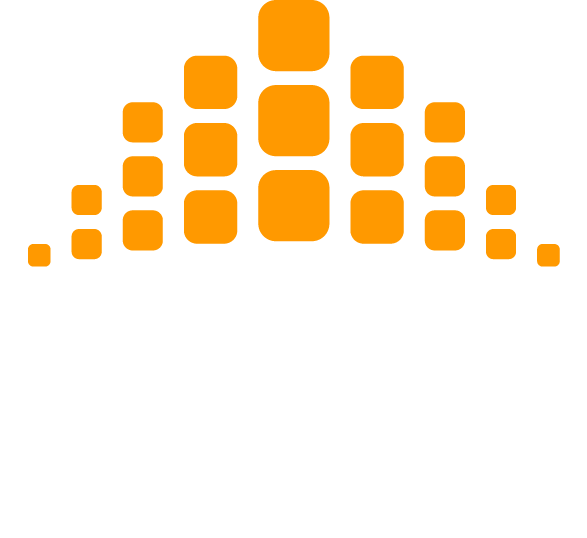
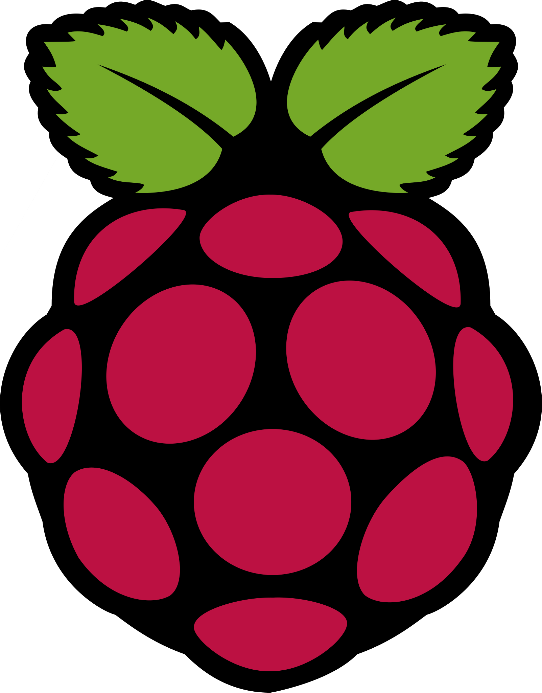

<h1 align="center">Hi 👋, I'm Kurayi Chawatama</h1>
<h3 align="center">Junior Year Molecular Biology & Genetics Student with a Passion for Bioinformatics and Systems Biology</h3>

- 🌍 **Proudly Zimbabwean 🇿🇼, Studying in Türkiye 🇹🇷**
  
- 🎯 **Experience and Projects:**
  - **Bioinformatics and Wet lab Research in Cancer Biology**: I am currently supporting various bioinformatics and wet lab tasks in [Prof. Berrin Tunca](https://scholar.google.com/citations?user=YUU5CvoAAAAJ&hl=en)'s cancer research lab while leading an extramurally funded project under her guidance titled "Characterizing Tumor Microenvironment Transcriptome Variations in NASH and Viral Hepatocellular Carcinomas for Targeted Therapy"
  - **Erasmus+ Funded Summer Research Position**: Conducted research in [Prof. Vicente Pelechano Garcia](https://pelechanolab.com/)'s lab at Karolinska Institutet/Scilifelab in Sweden, focusing on cancer stem cell heterogeneity in hepatocellular carcinoma. Developed a regression-based method to score transitioning cells and identify molecular signatures using CITE-seq data. Validated these findings in the TCGA-LIHC dataset, linking cell plasticity and drug-resistant populations to relapse risk and patient outcomes.
  - **EU-Funded SUSA Internship Program**: Accepted to the [SUSA internship program](https://ec.europa.eu/info/funding-tenders/opportunities/portal/screen/opportunities/competitive-calls-cs/11143) within an EU-funded project in [Asst. Prof. Burçak Otlu](https://scholar.google.com/citations?user=KWXbqQ8AAAAJ&hl=en)'s lab at Middle East Technical University. During this internship, I developed reproducible Nextflow pipelines for large-scale WES/WGS cancer genomics analyses, including somatic variant calling and mutational signature analysis. I also performed basic processing and analysis of multiple omics data types at scale, including: ChIP-seq, Methyl-seq, and Bulk RNA-seq.
  - **Open Source Nextflow Pipeline Development**: I actively contribute to [nf-core/scdownstream](https://nf-co.re/scdownstream/dev/), enhancing scRNA-seq analysis by fixing runtime errors and developing [doublet detection modules](https://github.com/nf-core/scdownstream/pull/261). Contributed documentation and authored a [blog post](https://nf-co.re/blog/2025/nf-core-colab-guide) and [documentation](https://nf-co.re/docs/tutorials/google_colab/nf-core_colab_guide) on running nf-core pipelines in Google Colab as part of the [outreach team](https://nf-co.re/governance#outreach).
  - **scRNASeq Data Analysis**: Worked as a summer intern at [Asst. Prof. Atakan Ekiz](https://www.atakanekiz.com/lab.html)'s lab, focusing on cancer immunology-based gene expression profiling and transcriptomic insights from bulk and scRNA-seq data
  - **DNA Methylation Data Analysis**: Contributed to the [Comprehensive Analysis of Promoter Methylation Effects on the GPRC5A Methylation Profile Across Various Cancer Types](https://www.researchgate.net/publication/374535049_Comprehensive_Analysis_of_Promoter_Methylation_Effects_on_the_GPRC5A_Methylation_Profile_Across_Various_Cancer_Types), investigating the impact of promoter methylation on cancer-associated gene expression
   - **Development of the [ChemNose Platform](https://github.com/KurayiChawatama/ChemNose-An-Automated-Gas-Detection-and-Statistical-Analysis-Platform)**: Led the development of an **Arduino** and **R** based gas detection and statistical analysis platform for [Ulurover Team](https://www.linkedin.com/company/ulurover-team/posts/?feedView=all)'s competitive **Mars Rover**, integrating real-time data collection and analysis. Building on this, I am now leading the development of a next-generation **fully autonomous Raspberry Pi–powered minilab** for in situ chemical analysis and life detection ([Ulurover Minilab](https://github.com/KurayiChawatama/Ulurover-Minilab)).

- 🌱 I’m currently learning **machine and deep learning techniques** for multiomics data integration.

- 💬 Ask me about **single cell transcriptomics**

- ⚡ Fun Fact: I have a strong interest in robotics (Arduino and Raspberry Pi) and enjoy developing them for biotech applications, inspired by my work leading the Science Team of [Ulurover Team](https://www.linkedin.com/company/ulurover-team/posts/?feedView=all)'s competitive **Mars Rover**

- ✉️ How to reach me: [Explore my profiles on my website](https://kurayi-chawatama.github.io/)

<h3 align="left">Languages and Tools:</h3>

  
</a>

