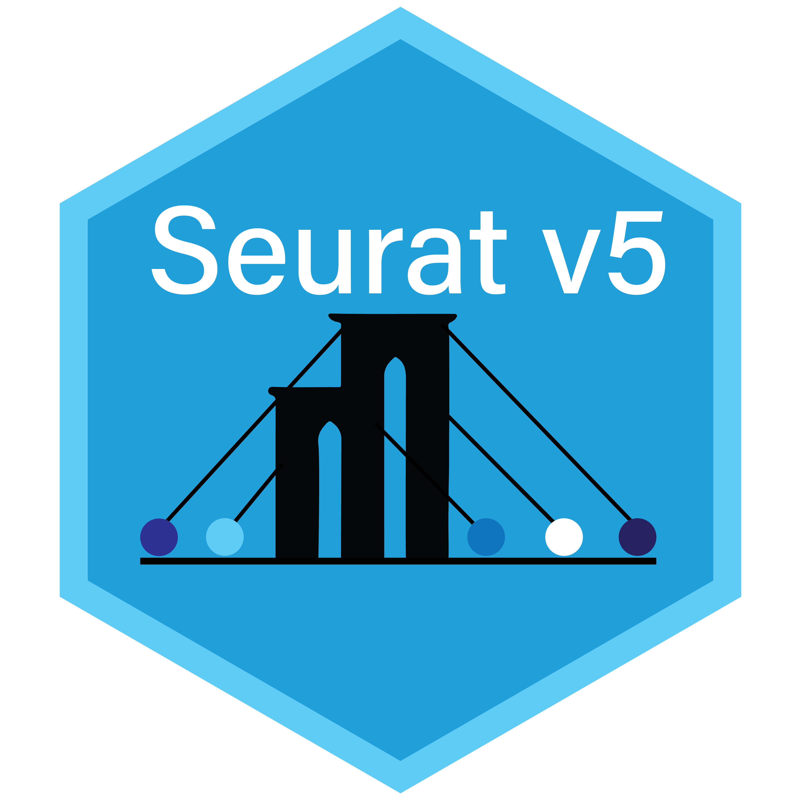
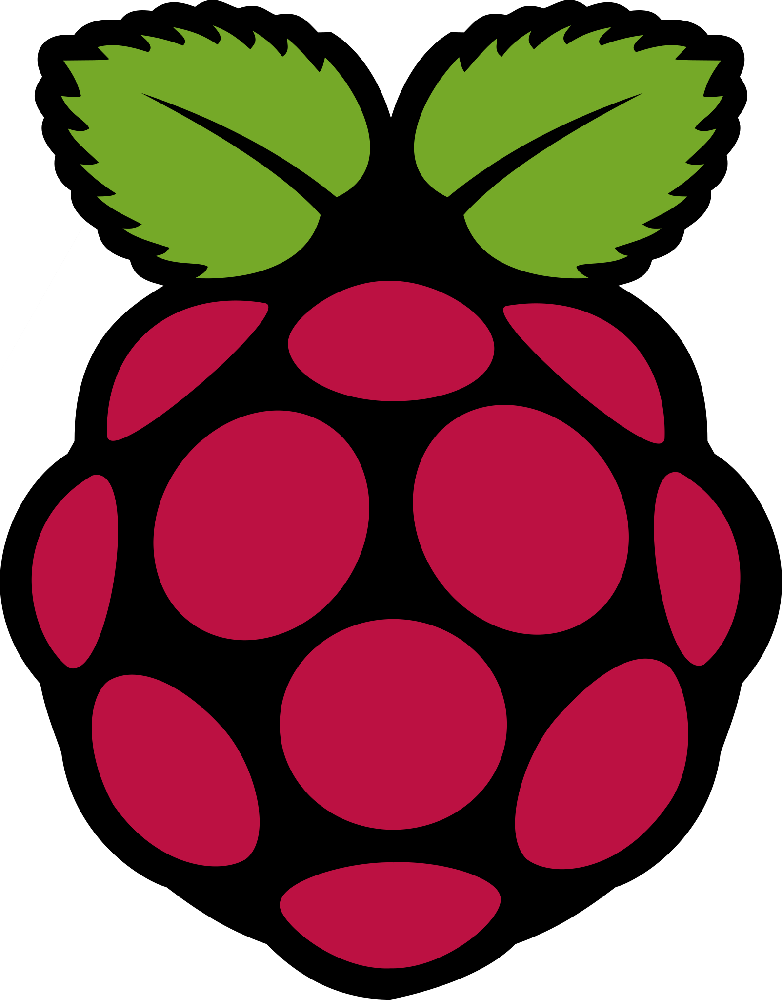

<h1 align="center">Hi 👋, I'm Kurayi Chawatama</h1>
<h3 align="center">Sophomore Molecular Biology & Genetics Student with a Passion for Bioinformatics and Systems Biology</h3>

- 🌍 **Proudly Zimbabwean 🇿🇼, Studying in Türkiye 🇹🇷**
  
- 🎯 **Experience and Projects:**
  - **Bioinformatics and Wet lab Reasearch in Cancer Biology**: I am currently supporting various bioinformatics and wet lab tasks in Prof. Dr. [Berrin Tunca](https://scholar.google.com/citations?user=YUU5CvoAAAAJ&hl=en)'s cancer research lab and independently leading an extramurally funded project titled "Characterizing Tumor Microenvironment Transcriptome Variations in NASH and Viral Hepatocellular Carcinomas for Targeted Therapy"
  - **RNASeq Data Analysis**: As a summer intern at [Atakan Ekiz Lab](https://www.atakanekiz.com/lab.html), focusing on cancer immunology based gene expression profiling and transcriptomic insights from bulk and scRNA-seq data
  - **DNA Methylation Data Analysis**: Contributed to the [Comprehensive Analysis of Promoter Methylation Effects on the GPRC5A Methylation Profile Across Various Cancer Types](https://www.researchgate.net/publication/374535049_Comprehensive_Analysis_of_Promoter_Methylation_Effects_on_the_GPRC5A_Methylation_Profile_Across_Various_Cancer_Types), investigating the impact of promoter methylation on cancer-associated gene expression
  - **Development of the [ChemNose Platform](https://github.com/KurayiChawatama/ChemNose-An-Automated-Gas-Detection-and-Statistical-Analysis-Platform)**: Led the development of an **Arduino** and **R** based gas detection and statistical analysis platform for [Ulurover Team](https://www.linkedin.com/company/ulurover-team/posts/?feedView=all)'s competitive **Mars Rover**, integrating real-time data collection and analysis

- 🌱 I’m currently learning **machine learning techniques** to enhance biological data analysis and discover new insights

- 💬 Ask me about **molecular biology, bioinformatcs, and transcripotmics**

- ⚡ Fun Fact: I have a strong interest in robotics (Arduino and Raspberry Pi) and enjoy developing them for biotech applications, inspired by my work leading the Science Team of [Ulurover Team](https://www.linkedin.com/company/ulurover-team/posts/?feedView=all)'s competitive **Mars Rover**

- ✉️ How to reach me: [Explore my profiles on Linktree](https://linktr.ee/kurayi_chawatama)

<h3 align="left">Languages and Tools:</h3>

  
 
 

 

